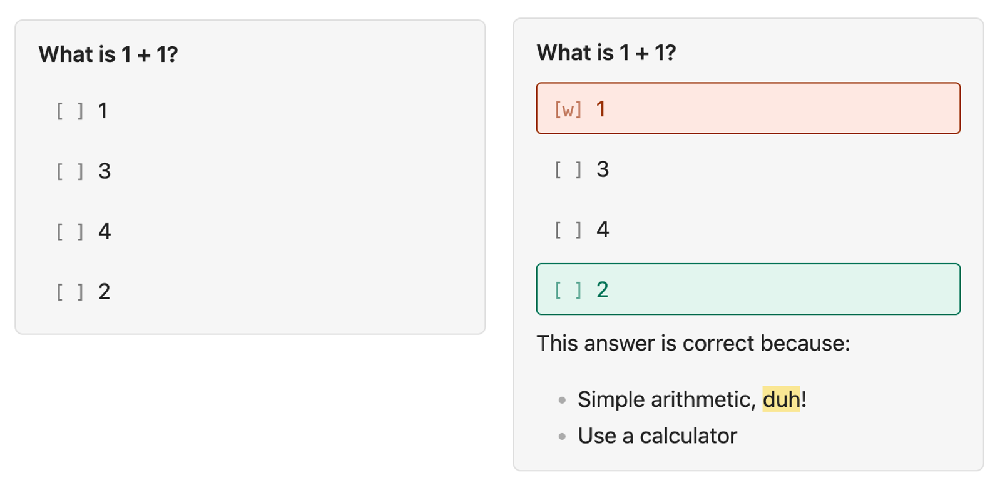

# quizblock

As the name implies: a simple quiz block format to help create interactive quizzes in your Obsidian notes. quizblock is intentionally lightweight and adds one Markdown processor and one command.

The format is simple, powerful, and built with LLMs in mind. See [SKILLS.md] to understand how quizblock can integrate with your LLM of choice.


## How to use
Here is a quiz block. You get interactivity, hidden explanations, and question order shuffling included for free:
<pre>
```quiz
What is 1 + 1?
[ ] 1
[c] 2
[ ] 3
[ ] 4

This answer is correct because:
- Simple arithmetic, ==duh==!
- Use a calculator
```
</pre>

You can preview this block in Live Preview or Reading mode. You can answer this block interactively in Live Preview mode. Your selected options persist in the Markdown.



## Install
Install [BRAT using its Quick Guide](https://tfthacker.com/brat-quick-guide), and add the quizblock plugin link: `https://github.com/olliecheng/quizblock`. Enable the plugin from Community Plugins.

## Format
The simple anatomy of a quiz block is:
<pre>
```quiz
Question stem prompt
[ ] Answer A
[ ] Answer B
[c] Answer C
[ ] Answer D

Explanation, in Markdown - supports Obsidian's Markdown features
```
</pre>

If a quiz has not been attempted, the correct answer should be marked using `[c]` at the start. If a quiz has been attempted:
- If the attempt was **correct**: the correct attempt should be marked using `[r]`
- If the attempt was **incorrect**: the incorrect attempt should be marked using `[w]`  
  The correct answer should still use `[c]`

<details>
<summary>Example</summary>
<strong>Note.</strong> This is handled automatically by <em>quizblock</em> when the user selects an option. In most cases, you do not need to manually adjust this.
<br /><br />
In this case, the user has answered "3" incorrectly.
<pre>
```quiz
What is 1 + 1?
[ ] 1
[c] 2
[w] 3
[ ] 4
```
</pre>
In this case, the user has answered "2" correctly.
<pre>
```quiz
What is 1 + 1?
[ ] 1
[r] 2
[ ] 3
[ ] 4
```
</pre>
</details>

## Motivation
I think that MCQs are quite a good way to test and learn content.

- eMedici/Passmedicine etc. provide premade questions which reinforce guidelines - great practice, but in practice not always too relevant to what you're learning
- Gemini's Canvas Quiz feature is powerful and flexible, but doesn't integrate into your notes. Plus, you can only generate a set number of MCQs at a time - this can make it hard to comprehensively test a large set of notes
- Chat interfaces (ChatGPT etc.) can generate unlimited questions, but the text interface makes an immersive MCQ format challenging

Obsidian provides an extensible text platform and already provides integration with your notes (i.e. via Tasks). Therefore - what if plaintext was your canvas for MCQ questions, with a renderer in Obsidian? You can generate questions using whatever you want: the web interface of ChatGPT, Claude, Gemini, or your agentic tool of choice.

Plus, this way you can share your questions with your friends!